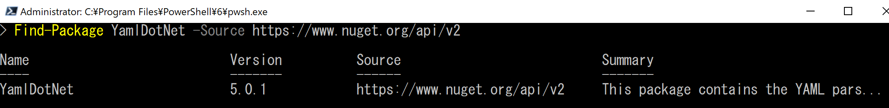
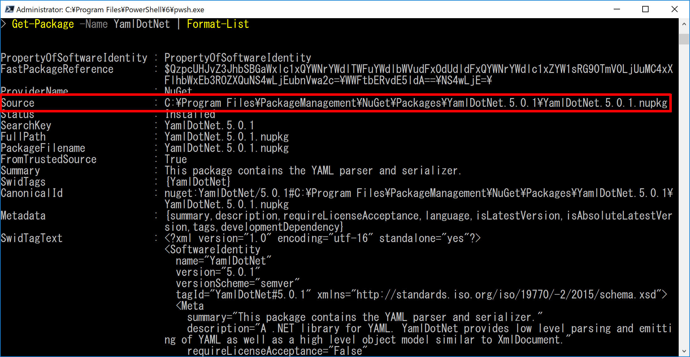
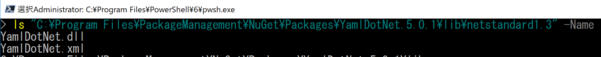

# 🔰YamlDotNetをPowershellからさわってみる

Yaml形式に少し手を出してみて、これをPowershellからパースするのなんか無いかな？　と探したら。
.NetのライブラリにYamlDotNetなる物が公開されていたので、これをPowershellからさわってみます。

##　🔰YamlDotNetとは

Nugetに公開されているYamlの.netライブラリ。

[nuget - YamlDotNet](https://www.nuget.org/packages/YamlDotNet/)
[github - aaubry / YamlDotNet](https://github.com/aaubry/YamlDotNet)

## 🔰ライブラリのインストール

[nuget - YamlDotNet](https://www.nuget.org/packages/YamlDotNet/)

PowershellからNugetのライブラリを確認してみます。

```Powershell
Find-Package -Name YamlDotNet -Source https://www.nuget.org/api/v2
```

YamlDotNetの5.0.1が見つかりました。



みつかったライブラリをInstall-Packageコマンドに渡してインストールします。
ちなみにInstall-Packageを実行するときはPowershellを管理者実行してください。

```Powershell
Find-Package -Name YamlDotNet -Source https://www.nuget.org/api/v2 | Install-Package
```


Get-Packageコマンドでインストールされたライブラリを確認してみます。

```Powershell
Get-Package -Name YamlDotNet | Format-List
```



Get-Packageで戻ってきた情報をFormat-Listで整形して表示してみましたが、Sourceというを見るとnupkgファイルが有ることがわかります。

本記事を書いている環境だと`C:\Program Files\PackageManagement\NuGet\Packages\YamlDotNet.5.0.1\YamlDotNet.5.0.1.nupkg`

nupkegが置いてあるディレクトを確認すると、libというディレクトリがありこの中に各.Net用ライブラリのdllがインストールされています。

YamlDotNetの5.0.1には.NetStandard用のdllがあるようなので今回はこれを利用してPowershell6.1から利用してみます。



## 🔰Powershellから利用してみる

YamlDotNetの使い方については、公式のwikiに色々とかいてあるのでこれをみればOK。

[github - aaubry/YamlDotNet - wiki](https://github.com/aaubry/YamlDotNet/wiki)

### 🔰Yamlのデシリアライズ

Yamlのサンプルでよくみかける下記のYamlをデシリアライズしてみる。
下記内容を`c:\temp\sample.yaml`に保存する。

```yaml
---
receipt:     Oz-Ware Purchase Invoice
date:        2012-08-06
customer:
    first_name:   Dorothy
    family_name:  Gale

items:
    - part_no:   A4786
      descrip:   Water Bucket (Filled)
      price:     1.47
      quantity:  4

    - part_no:   E1628
      descrip:   High Heeled "Ruby" Slippers
      size:      8
      price:     133.7
      quantity:  1

bill-to:  &id001
    street: |
            123 Tornado Alley
            Suite 16
    city:   East Centerville
    state:  KS

ship-to:  *id001

specialDelivery:  >
    Follow the Yellow Brick
    Road to the Emerald City.
    Pay no attention to the
    man behind the curtain.
...
```

下記公式のサンプルを見ると、YamlStream.loadにテキストを突っ込めばよさそう。
YamlStream.loadをみてみるとSystem.IO.TextReaderを入力してあげればよさそうなので、
公式のサンプルではhere documentでSystem.IO.Stringで入力してますが、こちらはテキストファイルからSystem.IO.StreamReaderで入力する。

[Samples.LoadingAYamlStream](https://github.com/aaubry/YamlDotNet/wiki/Samples.LoadingAYamlStream)

```Powershell
#　まずはAdd-Typeでライブラリの読み込み
Add-Type -Path "C:\Program Files\PackageManagement\NuGet\Packages\YamlDotNet.5.0.1\lib\netstandard1.3\YamlDotNet.dll"
# StreamReaderの準備
$sampleYaml = New-Object System.IO.StreamReader("c:\temp\sample.yaml")
# yamlStreamの準備
$yamlStream = New-Object YamlDotNet.RepresentationModel.YamlStream
# yamlStreamにStreamReaderをロード
$yamlStream.load($sampleYaml)
# これがYamlDotNet.RepresentationModel.YamlNodeとかいうものらしい
$mapping=$yamlStream.Documents[0].RootNode
# YamlNodeのchildrenをみてみる
$mapping.children
# ジェネリックな感じ
$mapping.children.gettype()
# KEY dateを指定して読み出してみる
$mapping.children["date"]
```

テキストファイルに記述されたYamlからdateというキーに紐づく値を取得する事ができました。

### 🔰yamlのシリアライズ

下記サンプルを参考にやってみる。

[Samples.SerializeObjectGraph](https://github.com/aaubry/YamlDotNet/wiki/Samples.SerializeObjectGraph)

```Powershell
#　まずはAdd-Typeでライブラリの読み込み
Add-Type -Path "C:\Program Files\PackageManagement\NuGet\Packages\YamlDotNet.5.0.1\lib\netstandard1.3\YamlDotNet.dll"
# SerializerBuilderの準備
$builder = new-object YamlDotNet.Serialization.SerializerBuilder
# serializerの準備
$serializer = $builder.build()
# stringをシリアライズ
$serializer.Serialize("hello world")
# 配列をシリアライズ
$serializer.Serialize(@("hello","world","!"))
# 連想配列をシリアライズ
$serializer.Serialize(@{"hello"="world";"foo"="bar"})
# 連想配列の中に配列を入れたり色々
$serializer.Serialize(@{"hello"="world"; "foo"="bar"; "arrayHelloWorld"=@("Hello","World"); "root"=@{"helloworld"=@{"foo"="bar"}}})


```

こんな感じで基本的な型はうまく動くが、pscustomobjectとかはうまく動かないっぽい。
そういう場合は適宜動くような形に変換してあげればとりえず出力できそう。

## 🔰まとめ

PowershellでYamlをさわりたい場合でも、.Netなライブラリがあるから大丈夫！　って感じ。
ちなみに探してみると他にも

- YamlDotNetをラップしてる[cloudbase/powershell-yaml](https://github.com/cloudbase/powershell-yaml)なるものもあったり
- [Phil-Factor/PSYaml](https://github.com/Phil-Factor/PSYaml)とかいうのもある模様

ConvertFrom-JsonとかConvertTo-JsonとかがPowershell v3から標準搭載されたように、Yamlがものすごい流行ったりしたらPowershellに標準搭載される時代がきたりするんですかね？
色々と議論はされているようですが。

[PowerShell/PowerShell - #3607 ConvertFrom-Yaml, ConvertTo-Yaml](https://github.com/PowerShell/PowerShell/issues/3607)
